# OmniBOLT #6: Automatic Market Maker model, Liquidity Pool and DEX on Lightning Network 

* Oct 04.2021: This work is in progress. 
* Apr 27.2022: Mechanism supports both discrete and continuous models in section 2. 
* Since Jun 23.2022, this work applies zero-knowledge proof to solve some security flaws of the original design. 

# Table of Contents
 * [introduction](#introduction)
 * [liquidity pool：from discrete to continuous space ](#liquidity-pool-from-discrete-to-continuous-space )
 	* [continuous space](#continuous-space)
	* [limit order](#limit-order) 
 	* [coordinate charts and local invariant definition](#coordinate-charts-and-local-invariant-definition)
 	* [example: constant function invariants](#example-constant-function-invariants)
 	* [capital efficiency](#capital-efficiency)
 	* [slipage estimation](#slipage-estimation)
 	* [properties of local invariant model](#properties-of-local-invariant-model)
 * [signing an order](#signing-an-order)
 * [adding liquidity](#adding-liquidity)
 * [removing liquidity](#removing-liquidity)
 * [O(1) complexity of add and remove operations](#O1-complexity-of-add-and-remove-operations)
 * [channel state transition](#channel-state-transition)
 * [trackers running a matching engine](#trackers-running-a-matching-engine)
 	* [example for matching orders](#example-for-matching-orders)
 	* [token trading against liquidity pool](#token-trading-against-liquidity-pool)
 * [fee structure](#fee-structure)
 * [impermanent loss](#impermanent-loss)
 * [oracle](#oracle)
 * [differences from onchain AMM Swaps](#differences-from-onchain-AMM-Swaps)
 * [reference list](#reference-list) 


## introduction

The automatic market maker (AMM for short) model on lightning network holds significant advantages compared to the on-chain AMM[1,6] exchanges:  

1. There is no gas fee for each swap.  
2. Token swap is quick so that high-frequency trading is feasible.   
3. Liquidity is for both payment and trading.  

Uniswap[2], Curve[3], and Balancer[4], which operate on an automated market maker (AMM) model, by defining a global constant invariant, ensure the closing certainty and the efficient use of capital for on-chain trading. Their smart contracts hold liquidity reserves of various token pairs and traders execute swaps directly against these reserves. In this model, prices are set automatically according to a constant product `x*y=k` model (or its variants), where `x` is the number of token A and `y` is the number of token B in a pool. When a trader sells out `x'` token A for `y'` token B, the amount of token A in the pool increases and the amount of token B decreases,  but the product remains the same: `(x+x')*(y-y')=x*y=k`.  

Liquidity providers are incentivized by receiving the transaction fee (0.3% in general).  

This paper presents an AMM on the lightning network, which is more general than the current existing constant product/sum/mix models, and the infrastructure is completely different from the on-chain AMM. **It is an abstraction of the constant invariant model**: the curve is a 1-manifold, which is locally homeomorphic to the open unit circle, not predefined, but calculated during the system working. We don't make any assumptions about the pricing of underlying assets. At different price levels and with the changing of the intrinsic value of assets, the shape of the curve has to change. This model is not only for lightning network, but also suitable for any layer 2 networks.

We introduce the concept manifold here because the global curve is not proper to be predefined. Constant product or constant sum invariants are special cases of 1-manifold. The two models work because the arbitragers will exploit tiny price differences between different markets if the price deviates substantially from fair value. Without arbitragers, the curve itself can not price the asset.   

This paper takes arbitrage into modeling and outlines the core mechanism of how AMM on LN works. We assume readers are familiar with both LN and AMM so we will omit the introduction to basic concepts. For Bitcoin lightning network, we refer to lnd, and for smart asset lightning network, we refer to Omnibolt.

## liquidity pool: from discrete to continuous space 

LN already has funded channels to support multi-hop HTLC payment. Channels funded by a certain token form a logical network, where Alice is able to pay Bob even if they don't have a direct channel. Nodes on the payment path offer liquidity and receive a portion of the fee if the payment is a success.  

In the AMM model, liquidity providers play a similar role: if a swap succeeds, one who deposits his tokens into the contract will get commission fee according to the proportion of his contribution to the token pool.  
 
<p align="center">
  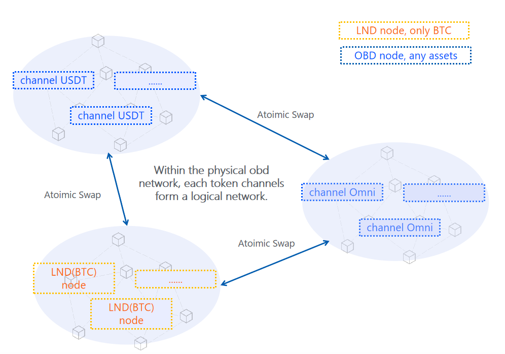
</p>

Naturally, funded channels in lightning network form a global liquidity pool, the difference is that the whole lightning network is a pool, every node maintains a portion of liquidity, while onchain AMM uses a contract address to collect liquidity: all tokens are deposited into one address.  

### continuous space
Conceptually, an order book is a discrete space consisting of a series of orders at multiple prices. There must be a spread between the highest bid and the lowest ask, if the spread is too wide, then no transaction could be closed. If the order book dex is on-chain, makers will often take losses of miner fee. 

To gain the certainty of closing, we leverage the funded channels to fill the spreads between all prices. Thus we have a continuous space that covers the entire price space. When price moves, liquidity providers have an incentive to concentrate liquidity around the current price for higher commissions. They revoke old liquidity ranges and submit new liquidity ranges that cover the current price. This hedges against the liquidity sparsity of the order book model.  

<p align="center">
  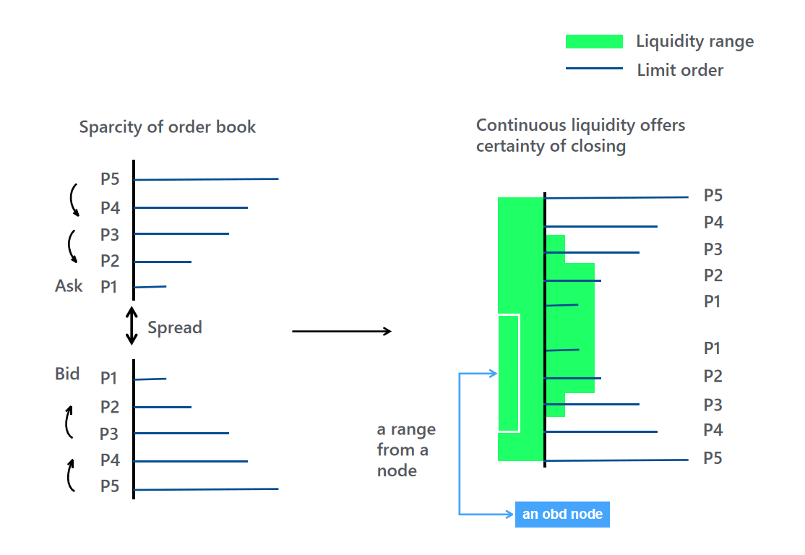
</p>

All small ranges(`U_i`) patching together is homeomorphic to real 1-space (`R^(n)， n=1`):

<p align="center">
  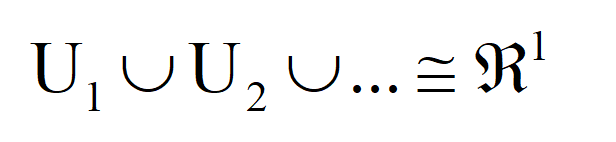
</p>

For engineering practice, we can assume that the space is differentiable. 

After a node commits a liquidity range, it will receive a commission fee when swapping within the range. The Lightning Network has no contract to collect commissions fee for liquidity providers, but instead utilizes a routing protocol that enables liquidity providers' channel funds to be used for trading, hence these channels earn commission fees directly. 

We begin with a discussion of limited order, which acts similar to a small range which is defined in Uniswap V3[8] for precisely managing liquidity distribution.

### limit order

A limit order is an extreme case of a liquidity range, where the lower bound equals the upper bound. Signing a limit order equals committing to the global liquidity pool:   

```
orderMessage  
{  
    tokenSell: “USDT”  
    amount: 20  
    networkA: obd  
    tokenBuy: “BTC”  
    networkB: lnd  
    ratio: {  
	USDT: 60000  
	BTC: 1  
	}  
    expirationTimestamp: 24*90 hours
    signature: signed by maker's private key
    nonce: to prevent replay attacks
}   

```

**tokenSell**: The token for sale. 

**amount**: The amount of token for sale.  

**networkA**: the network name(ID) the token is issued.  

**tokenBuy**: The token wanted.  
    
**networkB**: the network name(ID) the token wanted is issued.  

**ratio**: The price.   

**expirationTimestamp**: If the order times out, it will be automatically cancelled. 

**signature**: All signatures of orders are deterministic, using RFC6979 (using HMAC-SHA256), and the maximum length is 73 bytes.  

**nouce**: to prevent replay(repeat) attacks.  

If one token is denominated in the other token, then the price `P` is the ratio of the two tokens. A buyer's order is a left-closed and right-open interval `[P, $\infty$)`. The union of all buyers' intervals covers the space of Bitcoin buyer's liquidity, if tokenSell is USDT, and tokenBuy is Bitcoin:  

<p align="center">
  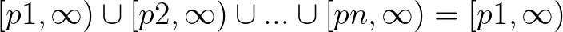
</p>

If the token amount on an intersection `$[P1, \infty) \cap [P2, \infty) = [P1, P2)$` ( which is still an interval ) is consumed by sellers' orders, then the price moves up from `P1` to the next limit `P2`.   

### coordinate charts and local invariant definition

For each `P_i = (x_i, y_i)` has a neighborhood `U_i` homeomorphic to an open circle. The basic formula above will change: token amount is continuous on any continuous interval included in the range. 

<p align="center">
  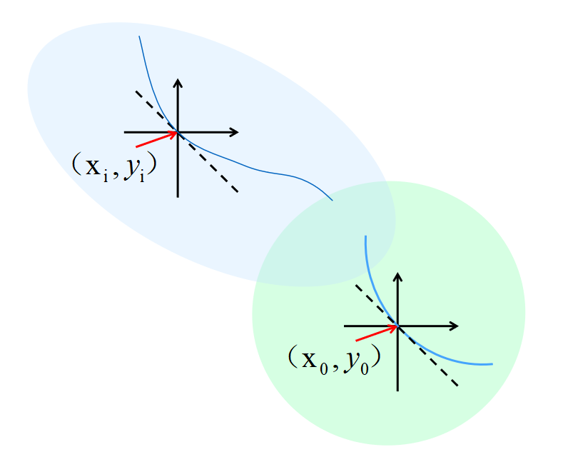
</p>

We build local charts around `(x_i, y_i), i=0,1,2,...` to cover the whole price space. Let the local liquidity function `y=f(x)`, assume `f(x)` is differentiable around a certain `(x_i, y_i)`. It has a power series based on a function's derivatives( under the convention 0^0 = 1 ):  

<p align="center">
  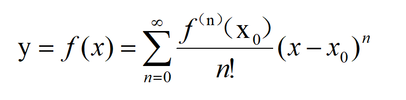
</p>

If we take `n=0,1` in the series and discard all others, then locally any curve approximates a line.   

### example: constant function invariants

#### example 1：
If let:     

<p align="center">
  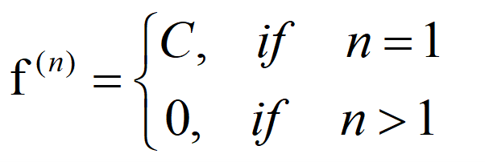
</p>

Where `C` is a constant. Then near any point, the invariant model is the constant sum model defined in Curve[3](Curve is the project name, not the geometry object).   

#### example 2：

If let:
<p align="center">
  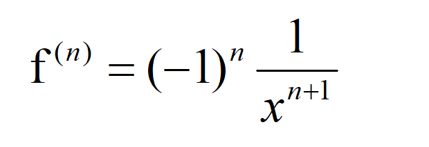
</p>

Then near any point, this is the constant product model defined in Uniswap[2]. It also models the ranged liquidity in V3.  

Derivatives in the above expansion can be calculated from the trading data around the point. Trading data includes orders posted and ranged liquidity deposited. Apparently, piece-wise invariants can be glued(a topological operation) together to form a global curve, as shown in the above graph. 


### capital efficiency
TO DO(Ben, Neo)

### slipage estimation
TO DO(Ben, Neo)

For a regular market, sometimes the more you buy the higher the marginal exchange rate that you have to pay for each additional unit, sometimes you don't need to pay extra money. This is totally depends on the liquidity provided by the sellers(counterparties). 

<p align="center">
  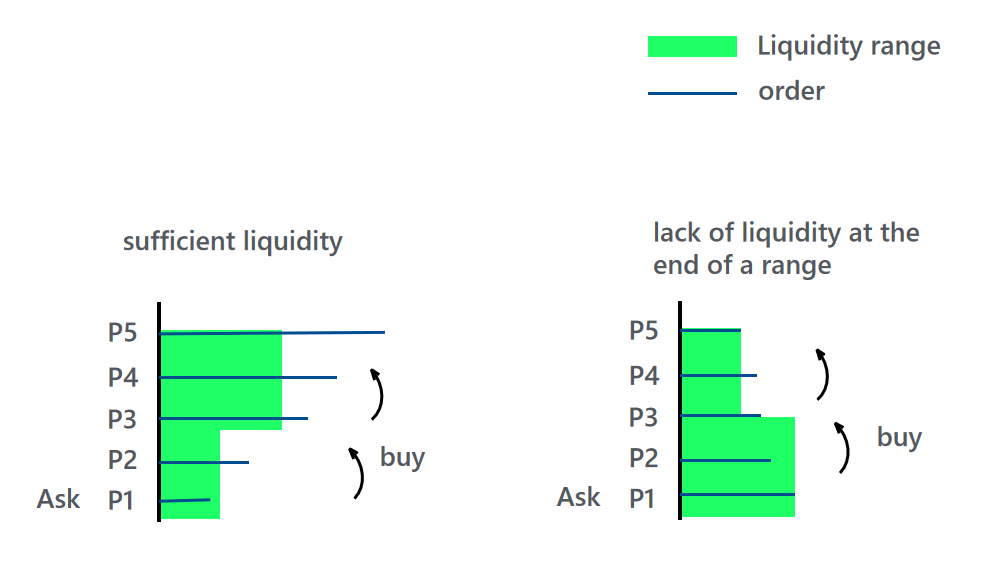
</p>

the two market states fit into two different curves. On the left market, the exchange rate won't grow fast as you buy more. But on the right side market, the slippage will be very large. 


### properties of local invariant model

TO DO(Ben, Carmack): 

1. Local invariant model make no assumption about pricing of underlying assets.  
2. Constant function(sum/product) invariants are special cases of local invariant model.  
3. Curvature measures how quickly the price changes.  
4. Liquidity and orders determines the curvature.    
5. Global (covers all price space) expression of the curve for all token pairs is unknown, and may not exist.  
6. Arbitragers help prices go around fair values. 
7. We should carefully calculate the parameters, to obtain lower slipage.


## signing an order

<p align="center">
  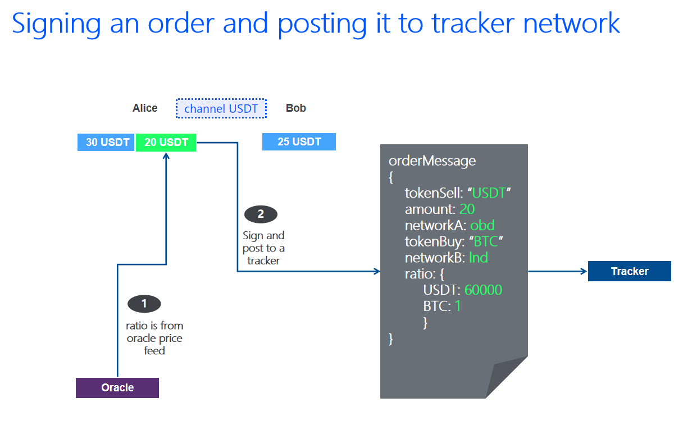
</p>

1. Alice gets the ratio(price) from a tracker or an oracle and signs the order.  
2. Alice post this order to a tracker.  

The tracker network must verify the signature. If all is correct, then sync it to neighbors and push it to connected nodes.  


## adding liquidity
TO DO(Ben, Neo): (add formular for ranges in this chapter or chapter 2)

Adding liquidity to the lightning network is simple: just open a channel with your counterparty and fund it. The lightning network discovers new channels and updates the network graph so that your channels will contribute to the global payment liquidity.  

But adding liquidity to an AMM pool is different. Not all the tokens funded in channels can be market maker liquidity reserves. Users need to sign ranged liquidity of pair (x, y) and post it to a tracker they connect to. At least two channels have to be opened and funded. 

The exchange rate is calculate from global `x/y`, feed by trackers:  

**Step 1**: Suppose Alice funded her BTC channel `x'`, then she should fund her USDT according to the current local invariant, for example, `y'= y(x+x')/x  - y`.   

**Step 2**: If she deposits more or less USDT, the extra tokens, USDT or BTC, will be marked as the payment liquidity reserve.  

**Step 3**: Alice signs and syncs her funding and specified range to her trackers, which record Alice's AMM liquidity for BTC and USDT.  

The first AMM liquidity provider could deposit any amount of BTC and USDT, the tracker will calculate how much BTC or USDT will be marked as AMM liquidity according to the price feed from an oracle.  

Funding a channel costs BTC gas fees. But adding(removing) liquidity has no cost.  

In section [impermanent loss](#impermanent-loss), there is a data simulation to help liquidity providers set appropriate ranges, minimize impermanent losses, and earn reliable trading fees. 


## removing liquidity

There are two ways to remove liquidity:   
1. withdraw signed and submitted orders and ranged liquidity.   
2. close the channel and withdraw tokens to the mainchain.    


Trackers calculate the remaining tokens in the global liquidity reserve, and the extra tokens will be marked payment liquidity reserve, according to exchange rate at the moment of closing channel:  

Suppose Alice closes her channel of `x'` BTCs, then the BTC-USDT pair will have redundant USDT in the pool. Its tracker randomly selects some USDT channels in the graph and marks a portion of channel fund `y'` to be the payment liquidity reserve, to make sure the global price `x/y = BTC/USDT` is unchanged. For example, `y' = y - y(x-x')/x`, if the current local invariant is constant product.   

There is no protocol fee taken during closing a channel. Only gas fee in BTC occurs.  

## O(1) complexity of add and remove operations

TO DO(Ben, Neo): apply binary tree and hash table to store ranged liquidity and limit orders, which has `O(1)` time complexity in adding and removing.  

## channel state transition 

We use **AMM balance** and **payment balance** to distinguish the two states of channel funds.  

<p align="center">
  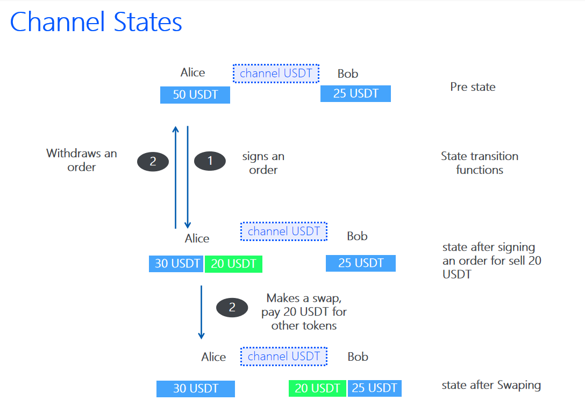
</p>

```
for a 75 USDT channel: [Alice, 75 USDT, Bob]
    e.g. Alice's local balance: 50 USDT before signing an order.  
         Bob's local balance: 25 USDT as payment balance. 
``` 

 

**Step 1**: After signing an order to sell out 20 USDT for BTCs, the channel state changes to: 
```
Alice's local balance: 20 USDT as AMM balance, and 30 USDT as payment balance.  
Bob's local balance: 25 USDT as payment balance.  
```

**Step 2**: After successfully selling out the 20 USDT, and getting Bitcoins in another channel, the channel state changes to:
```
Alice's local balance: 30 USDT as payment balance.  
Bob's local balance: 20 USDT as AMM balance, 25 USDT as payment balance.  
```

**OR**  

**Step 2**: Alice withdraws the order, then the channel state changes back to the origin.  
 
 
The global AMM liquidity will not change if Bob doesn't manually mark the 20 USDT as the payment balance.  

## trackers running a matching engine 

Trackers, in the design of the OmniBOLT network, not only maintain graph topology, but also maintain the global constant product model.  

When an OmniBOLT node is online, it has to announce itself to the network via a tracker it connects, as the rendezvous, notifying its neighbors to update its token type, amount of channels, and liquidity reserves. Omnibolt applies a tracker network to register nodes, and update the status of the nodes graph. Any tracker can be a rendezvous[5] that allows nodes to connect.  

 
Please go to the document of [Tracker network](https://omnilaboratory.github.io/obd/#/Architecture?id=tracker-network) to understand how it works.  

After a node sign and submit an order to a tracker, the tracker takes 6 steps to process the order:  
 

<p align="center">
  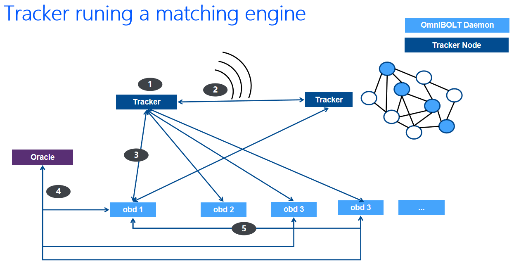
</p>

1. When receiving an order A from obd 1, the tracker searches its local order book database for matching.  
2. If can not find matching orders, it seeks its neighbors in the DHT network for order A.  
3. If the tracker collects matching orders that can (partially) fill the order A, it pushes the node's addresses and matching orders to obd 1.   
4. obd 1, 3, and 4 check price via an oracle. If the price gap is found to exceed the predefined threshold, the transaction is rejected.  
5. obd 1 Processes atomic swaps to obd 3 and 4.  
6. The remaining of the order will be saved in the tracker's local order book database, waiting for further deals. 

### example for matching orders

<p align="center">
  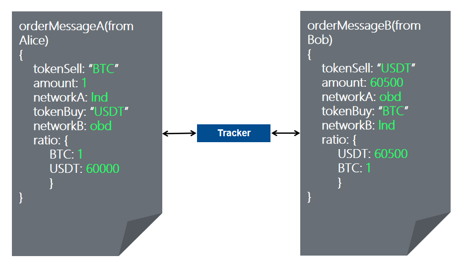
</p>


The matching engine picks a ratio between 60000:1 to 60500:1, for example, 60200:  

1. Alice sells 1 BTC for 60000 USDT, then the result is more than expected.  
2. Bob plans to sell 60500 USDT for 1 BTC, then the result is more than his expectation either. He only pays 60200 USDT.   
3. An order may be partially filled. For example: if B sells 121000 USDT for 2 BTC.   

### token trading against liquidity pool

Then a tracker maintains "almost" all nodes' balances and hence it is able to calculate the token price for a trade:  

Alice plans to sell out `x'` token A for a certain number of token B at the fee rate of `0.3%`. So that the pool will have `(x+x')` token A and `(y-y')` token B. The price after trade will be updated to `price(B) = (x+x')/(y-y')`. 

**Step 1**. Alice queries a tracker for the liquidity(all available orders) for both token A and token B networks. The tracker calculates the `y'` hence decides how much token B that Alice can get:  

```
fee = x * 0.3%  
A pool = x + x' - 0.3%x'  
B pool = x*y/(A pool)  

y' = y - B pool  

ratio = x'/y'  
``` 


**Step 2**: The tracker seeks multiple nodes, which together can provide `y'` token B, returns Alice the payment paths.  

**Step 3**. Alice creates [atomic swaps](https://github.com/omnilaboratory/OmniBOLT-spec/blob/master/OmniBOLT-05-Atomic-Swap-among-Channels.md#swap)[7] and sends them to these nodes respectively, where `ratio` is the price of token B at the moment of the trade. 

**Step 4**. Alice and all her counterparties finish the atomic swaps with all these nodes, and get `y'` tokens in the local **AMM balance**.  

```
Suppose x'/y' = 2, Alice sells out 10 A:  

          |--atomic swap---> Bob: 2 A for 4 B
          |
Alice ----|--atomic swap---> David: 4.5 A for 9 B 
          |
          |--atomic swap---> Carol: 3.5 A for 7 B

```

Fees are allocated to all nodes on the paths, and are still in the **AMM balance** of each node:  

```
A pool = x + x'
B pool = x*y/(x + x' - 0.3%x')

new invariant = (A pool) * (B pool) = (x + x')*x*y/(x + x' - 0.3%x')
```

 

**Like the characteristics of the lightning network, AMM is suitable for small transactions as well.**  


## fee structure

Token A to token B trades: 0.3% fee paid in A. This fee will be apportioned among the nodes in [atomic swap payment path](https://github.com/omnilaboratory/OmniBOLT-spec/blob/master/OmniBOLT-05-Atomic-Swap-among-Channels.md)[7], which means although the pool has many many liquidity providers, for each transaction, not all the providers get paid.  

Trackers balance the workload of the whole network: If one node is busy handling HTLC, another node will be selected to be a hop and earns the swap fee.  

If a liquidity provider thinks the tracker he connects is not fair enough, he may choose another one. Each tracker shall publish its path/node selection policy.  


## impermanent loss

Payment liquidity providers will never expose to any loss. Potential losses are only possible for AMM LPs who wish to use liquidity to earn trading fees.

It is AMM LP's decision to offer a wider liquidity range to earn more trading fees, or a narrow liquidity range to be less exposed to potential impermanent losses.   

Examples showing how impermanent loss happens and how much a loss could be can be found in [9,10]. The following graph and summary of losses compared to holding are from [10]:

<p align="center">
  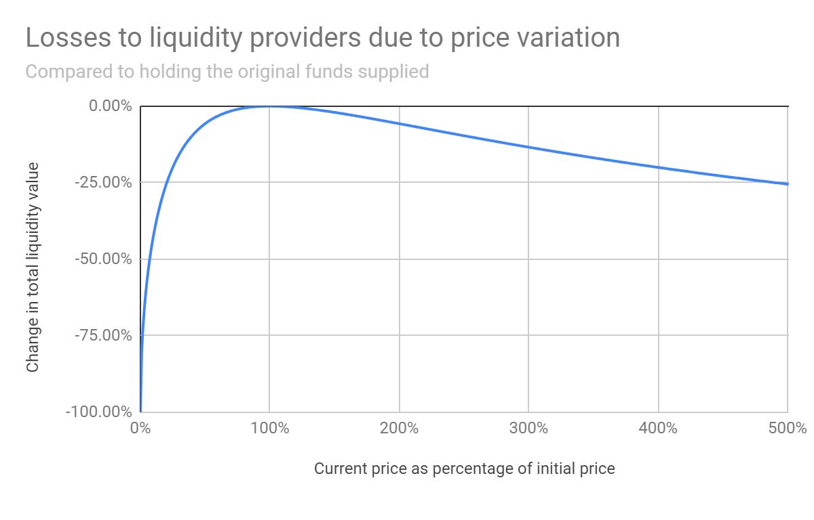
</p>
  
a 1.25x price change results in a 0.6% loss relative to HODL  
a 1.50x price change results in a 2.0% loss relative to HODL  
a 1.75x price change results in a 3.8% loss relative to HODL  
a 2x price change results in a 5.7% loss relative to HODL  
a 3x price change results in a 13.4% loss relative to HODL  
a 4x price change results in a 20.0% loss relative to HODL  
a 5x price change results in a 25.5% loss relative to HODL  


We use 1.50x price change as an example, given the trading fee of 0.3%. If the price stays within the 1.0X to 1.5x range for a month, suppose the transaction volume during this period is 100 times the liquidity in this range, then the expected earning is `0.3% * 100 = 30%`, which is significantly great than 2.0% loss. 

Concentrated liquidity has 4000x capital efficiency as claimed in uniswap V3, which means LPs can fund much less liquidity to earn significantly higher fees. If the price fluctuates in a narrow range for a long time, then the impermanent losses are negligible compared to the profitable trading fees. If the Bitcoin price rises quickly out of the range, all the liquidity will be entirely denominated in USDT, then the impermanent loss equals the Bitcoin liquidity funded, and no trading fee will be earned anymore. 


LP's strategy could be sticking the liquidity to the price movement. It all depends on the liquidity provider's prediction of the future market trend.  


## oracle
Oracle is involved to feed the real-time external price for trading. Although trackers give prices at any moment a trade occurs, obd should verify it from at least one oracle before the moment of executing this swap. If the price is below the expectation of the order signed, obd should reject the trade.  

## differences from onchain AMM Swaps

1. Price is from trackers who maintain statistics of global liquidity, but to avoid price manipulation, obd node should verify price from external oracles when trading tokens.   
  
2. Trackers maintain the global prices for all token pairs, but they have no permission to execute any trade. The lightning network has no global contract that executes transactions. Every obd node should verify the incoming order to avoid price manipulation. Obd does not have to trust any tracker.  

3. On-chain swaps use smart contracts to collect and allocate fees for liquidity providers. But the Lightning Network has no contract. We instead utilize a routing protocol that enables liquidity providers' channel funds to be used for trading, hence these channels earn commission fees directly. 


## reference list

1. Vitalik Buterin. The x*y=k market maker model. https://ethresear.ch/t/improving-front-running-resistance-of-x-y-k-market-makers.  
2. Uniswap. https://uniswap.org/
3. Michael Egorov. Curve. Automatic market-making with dynamic peg. https://curve.fi/files/crypto-pools-paper.pdf
4. Fernando Martinelli, Nikolai Mushegian. A non-custodial portfolio manager, liquidity provider, and price sensor. https://balancer.finance/
5. [Connect to a tracker](https://omnilaboratory.github.io/obd/#/OBD-README?id=step-2-connect-to-a-tracker): https://omnilaboratory.github.io/obd/#/OBD-README?id=step-2-connect-to-a-tracker  
6. Uniswap whitepaper. https://uniswap.org/whitepaper.pdf
7. Atomic swap. https://github.com/omnilaboratory/OmniBOLT-spec/blob/master/OmniBOLT-05-Atomic-Swap-among-Channels.md#swap
8. Hayden Adams, Noah Zinsmeister, et. Uniswap V3 white paper. https://uniswap.org/whitepaper-v3.pdf
9. Impermanent Loss Explained. https://academy.binance.com/en/articles/impermanent-loss-explained
10. Pintail. Uniswap: A Good Deal for Liquidity Providers?. https://pintail.medium.com/uniswap-a-good-deal-for-liquidity-providers-104c0b6816f2

 

 

 
 
